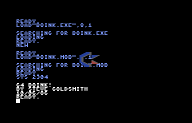

# Boink!

Remember the [Amiga Boing Ball demo](http://www.amigahistory.plus.com/boingball.html) from 1984? Well, I had to do a much simpler version for the C64 called Boink! I render a rotating/bouncing Commodore logo in the background using an interrupt (so you can code BASIC or do other stuff). I wrote this using the Commodore Macro Assembler Development System. You will see why I like Rebel assembler better :)  To run demo:

* Download [d64](https://github.com/sgjava/garage/raw/master/commodore/c64/boink/boink.d64.zip) and run in VICE or transfer to 1541 floppy.
* `load "boink.bas",8`
* `run`

To compile assembler code:
* `load "boot all",8`
* `run`
* `@s0:boink.obj`
* `@s0:boink.exe`
* `@$`
    * Make sure boink.obj and boink.exe are gone
* `/assembler64`
    * `run`
    * object file (cr or d:name): `boink.obj`
    * hard copy (cr/y or n)? `n`
    * cross reference (cr/no or y)?  `n`
    * source file name? `boink.asm` (use Alt+W to speed it up)
* `%hiloader64`
    * `sys 51200`
    * hex offset (cr if none) ?
    * object file name ? `boink.obj` (look for end address i.e. 0ae6 for ML monitor save)
* `%monitor$8000`
    * `sys 32768`
    * `s"boink.exe",08,0900,0ae7` (last parameter is end address +1 bytes)
    * `x`
* `sys 64738`
* `load "boink.bas",8`
* `run`

### FreeBSD License
Copyright (c) Steven P. Goldsmith

All rights reserved.

Redistribution and use in source and binary forms, with or without modification, are permitted provided that the following conditions are met:
* Redistributions of source code must retain the above copyright notice, this list of conditions and the following disclaimer.
* Redistributions in binary form must reproduce the above copyright notice, this list of conditions and the following disclaimer in the documentation and/or other materials provided with the distribution.

THIS SOFTWARE IS PROVIDED BY THE COPYRIGHT HOLDERS AND CONTRIBUTORS "AS IS" AND ANY EXPRESS OR IMPLIED WARRANTIES, INCLUDING, BUT NOT LIMITED TO, THE IMPLIED WARRANTIES OF MERCHANTABILITY AND FITNESS FOR A PARTICULAR PURPOSE ARE DISCLAIMED. IN NO EVENT SHALL THE COPYRIGHT HOLDER OR CONTRIBUTORS BE LIABLE FOR ANY DIRECT, INDIRECT, INCIDENTAL, SPECIAL, EXEMPLARY, OR CONSEQUENTIAL DAMAGES (INCLUDING, BUT NOT LIMITED TO, PROCUREMENT OF SUBSTITUTE GOODS OR SERVICES; LOSS OF USE, DATA, OR PROFITS; OR BUSINESS INTERRUPTION) HOWEVER CAUSED AND ON ANY THEORY OF LIABILITY, WHETHER IN CONTRACT, STRICT LIABILITY, OR TORT (INCLUDING NEGLIGENCE OR OTHERWISE) ARISING IN ANY WAY OUT OF THE USE OF THIS SOFTWARE, EVEN IF ADVISED OF THE POSSIBILITY OF SUCH DAMAGE.
