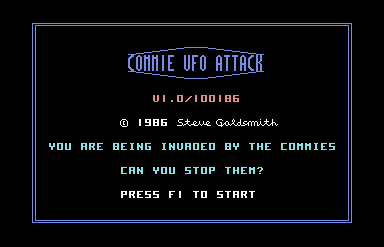
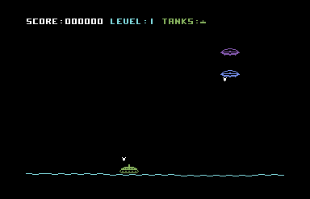

#Commie UFO Attack!

 

Ah yes, [Tesla's Modern Day Cowboy](https://www.youtube.com/watch?v=avAvkdYa3qM) + the Cold War + my first C64 100% Assembler game can mean only one thing, Commie UFO Attack! Commie UFO Attack is a shoot'em up I wrote back in 1986. The objective is kill or be killed. A new tank is awarded at each new level completed. The UFOs and bombs are worth more points on each level and the overall speed of the game increases.  

Tank versus UFO was one of the first games I typed in on the VIC 20, so my thinking was kick it up a notch with hardware sprites, a ground scroller and two UFOs dropping bombs. The SID was used of course for sound. I never tested it past a certain level, so it will speed up pretty fast maybe even beyond control. The game play is a lot more interesting than the VIC 20 original :) I wrote this using the Commodore Macro Assembler Development System. To run game:

* Download [d64](https://github.com/sgjava/garage/raw/master/commodore/c64/cua/cua.d64.zip) and run in VICE or transfer to 1541 floppy.
* `load "cua.bas",8`
* `run`

To compile assembler code:
* `load "boot all",8`
* `run`
* `@s0:cua.obj`
* `@s0:cua.exe`
* `@$`
    * Make sure boink.obj and boink.exe are gone
* `/assembler64`
    * `run`
    * object file (cr or d:name): `cua.obj`
    * hard copy (cr/y or n)? `n`
    * cross reference (cr/no or y)?  `n`
    * source file name? `cua.asm` (use Alt+W to speed it up)
    * `sys 64738`
* `load "loloader64",8`
    * `run`
    * hex offset (cr if none) ?
    * object file name ? `cua.obj` (look for end address i.e. 8997 for ML monitor save)
* `load "monitor$c000",8,1`
    * `sys 49152`
    * `s"cua.exe",08,8000,8998` (last parameter is end address +1 bytes)
    * `x`
* `sys 64738`
* `load "cua.bas",8`
* `run`

### FreeBSD License
Copyright (c) Steven P. Goldsmith

All rights reserved.

Redistribution and use in source and binary forms, with or without modification, are permitted provided that the following conditions are met:
* Redistributions of source code must retain the above copyright notice, this list of conditions and the following disclaimer.
* Redistributions in binary form must reproduce the above copyright notice, this list of conditions and the following disclaimer in the documentation and/or other materials provided with the distribution.

THIS SOFTWARE IS PROVIDED BY THE COPYRIGHT HOLDERS AND CONTRIBUTORS "AS IS" AND ANY EXPRESS OR IMPLIED WARRANTIES, INCLUDING, BUT NOT LIMITED TO, THE IMPLIED WARRANTIES OF MERCHANTABILITY AND FITNESS FOR A PARTICULAR PURPOSE ARE DISCLAIMED. IN NO EVENT SHALL THE COPYRIGHT HOLDER OR CONTRIBUTORS BE LIABLE FOR ANY DIRECT, INDIRECT, INCIDENTAL, SPECIAL, EXEMPLARY, OR CONSEQUENTIAL DAMAGES (INCLUDING, BUT NOT LIMITED TO, PROCUREMENT OF SUBSTITUTE GOODS OR SERVICES; LOSS OF USE, DATA, OR PROFITS; OR BUSINESS INTERRUPTION) HOWEVER CAUSED AND ON ANY THEORY OF LIABILITY, WHETHER IN CONTRACT, STRICT LIABILITY, OR TORT (INCLUDING NEGLIGENCE OR OTHERWISE) ARISING IN ANY WAY OUT OF THE USE OF THIS SOFTWARE, EVEN IF ADVISED OF THE POSSIBILITY OF SUCH DAMAGE.
