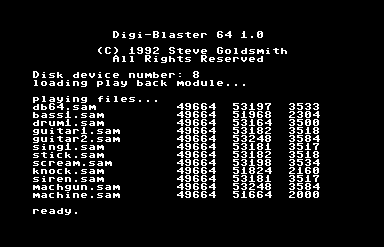

#Digiblaster 64

All of my digital sound worked started on the C64. This project includes the original variable rate code plus dedicated 22 and 26 KHz routines! If you have a Covox Voice Master then you can record as well. As far as I know this is the highest sample rate for the C64. Pretty impressive for a 1 MHz CPU! The play routines work with any 1 bit PCM encoded audio data.

This demo shows off digital sound on the C64. Here's how to run the demo:
* Download [d64](https://github.com/sgjava/garage/raw/master/commodore/c64/digiblaster64/digiblaster.d64.zip) and run in VICE or transfer to 1541 floppy.
* `load "db64.bas",8`
* `run`
    * Disk drive device number: `8`
    * Use 1541/1571 fast loader: `y` (Use `n` in VICE or it will lock up with certain C64 configurations)

To compile assembler code:
* `load "rebel",8`
* `run`
* `load "db64.asm",8`
* `*` (use Alt+W to speed it up)

### FreeBSD License
Copyright (c) Steven P. Goldsmith

All rights reserved.

Redistribution and use in source and binary forms, with or without modification, are permitted provided that the following conditions are met:
* Redistributions of source code must retain the above copyright notice, this list of conditions and the following disclaimer.
* Redistributions in binary form must reproduce the above copyright notice, this list of conditions and the following disclaimer in the documentation and/or other materials provided with the distribution.

THIS SOFTWARE IS PROVIDED BY THE COPYRIGHT HOLDERS AND CONTRIBUTORS "AS IS" AND ANY EXPRESS OR IMPLIED WARRANTIES, INCLUDING, BUT NOT LIMITED TO, THE IMPLIED WARRANTIES OF MERCHANTABILITY AND FITNESS FOR A PARTICULAR PURPOSE ARE DISCLAIMED. IN NO EVENT SHALL THE COPYRIGHT HOLDER OR CONTRIBUTORS BE LIABLE FOR ANY DIRECT, INDIRECT, INCIDENTAL, SPECIAL, EXEMPLARY, OR CONSEQUENTIAL DAMAGES (INCLUDING, BUT NOT LIMITED TO, PROCUREMENT OF SUBSTITUTE GOODS OR SERVICES; LOSS OF USE, DATA, OR PROFITS; OR BUSINESS INTERRUPTION) HOWEVER CAUSED AND ON ANY THEORY OF LIABILITY, WHETHER IN CONTRACT, STRICT LIABILITY, OR TORT (INCLUDING NEGLIGENCE OR OTHERWISE) ARISING IN ANY WAY OUT OF THE USE OF THIS SOFTWARE, EVEN IF ADVISED OF THE POSSIBILITY OF SUCH DAMAGE.
