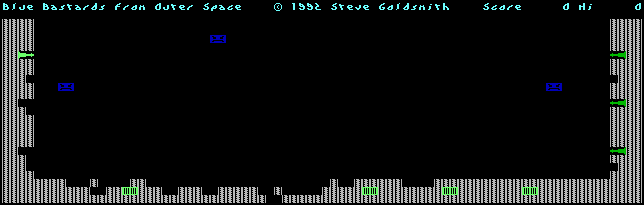
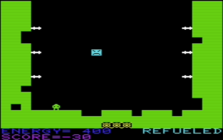

#Blue Bastards from Outer Space                                                 



This is a game based on the VIC 20 Blue Meanies from Outer Space. I believe I bought it around 1981 soon after I got my 5K VIC 20 and Dataset recorder. After being amazed by the graphics and game play (there were not many VIC 20 games when it first came out) I started looking at the code. I figured out to build my own games using some of the same tricks (setting the BASIC pointer to save off character sets and machine code).

The [original](https://github.com/sgjava/garage/raw/master/commodore/cpm/bbfos/bmfos.prg.zip)



My [game](https://github.com/sgjava/garage/raw/master/commodore/cpm/bbfos/bbfos.d81.zip) is as bit different of course and is really designed to show off the C128's features. I sampled guitar chords I played to build a simple song. I used sampled voice for various actions in the game. All of this fits into the small CP/M TPA. This includes a version of SG Tools Pro for Pascal, so you can use this source as the basis for other games. A single d81 image holds the entire development environment.

If you just want to run the game attach to the d81 disk image and boot into CP/M and type `blue` (or `blueint` for interlace mode) + Return. If you want to work on the code or compile it from scratch then:
* Boot into CP/M with [provided](https://github.com/sgjava/garage/raw/master/commodore/cpm/bbfos/bbfos.d81.zip) d81 disk image.
* Run `turbo`
* Press `m` to set Main file to blue.pas (blueint.pas if you want interlace version)
* Press `o`, `c`, `q` to set compile option
* Press `c` to compile (you can use Alt+W warp mode to speed up the compile, but use Alt+W again to turn it off when done)
```
LOGGED DRIVE: A

WORK FILE:
MAIN FILE: A:BLUE.PAS

EDIT     COMPILE  RUN   SAVE

EXECUTE  DIR      QUIT  COMPILER OPTIONS

TEXT:     0 BYTES (8118-8118)
FREE: 25837 BYTES (8119-E606)

>

LOADING A:BLUE.PAS
COMPILING  --> A:BLUE.COM
  2137 LINES

CODE: 13807 BYTES (20E3-56D2)
FREE: 34860 BYTES (56D3-DEFF)
DATA:  2114 BYTES (DF00-E742)

>
```

How to work with the source:
* CHED80 is included to edit character sets
* CDF and CGF character set formats are not compatible, but you can edit CGF in CHED80 by using `loadcgf` and running `ched80i`. This will not destroy the character set in memory. Once you exit CHED80 use `makecgf` to save file you can use for BBFOS.
* You can create your own ZBF files by recording 8 bit raw sounds and using `zbcnv` to convert it to 4 bit ZBF format.

### FreeBSD License
Copyright (c) Steven P. Goldsmith

All rights reserved.

Redistribution and use in source and binary forms, with or without modification, are permitted provided that the following conditions are met:
* Redistributions of source code must retain the above copyright notice, this list of conditions and the following disclaimer.
* Redistributions in binary form must reproduce the above copyright notice, this list of conditions and the following disclaimer in the documentation and/or other materials provided with the distribution.

THIS SOFTWARE IS PROVIDED BY THE COPYRIGHT HOLDERS AND CONTRIBUTORS "AS IS" AND ANY EXPRESS OR IMPLIED WARRANTIES, INCLUDING, BUT NOT LIMITED TO, THE IMPLIED WARRANTIES OF MERCHANTABILITY AND FITNESS FOR A PARTICULAR PURPOSE ARE DISCLAIMED. IN NO EVENT SHALL THE COPYRIGHT HOLDER OR CONTRIBUTORS BE LIABLE FOR ANY DIRECT, INDIRECT, INCIDENTAL, SPECIAL, EXEMPLARY, OR CONSEQUENTIAL DAMAGES (INCLUDING, BUT NOT LIMITED TO, PROCUREMENT OF SUBSTITUTE GOODS OR SERVICES; LOSS OF USE, DATA, OR PROFITS; OR BUSINESS INTERRUPTION) HOWEVER CAUSED AND ON ANY THEORY OF LIABILITY, WHETHER IN CONTRACT, STRICT LIABILITY, OR TORT (INCLUDING NEGLIGENCE OR OTHERWISE) ARISING IN ANY WAY OUT OF THE USE OF THIS SOFTWARE, EVEN IF ADVISED OF THE POSSIBILITY OF SUCH DAMAGE.

                                                                        