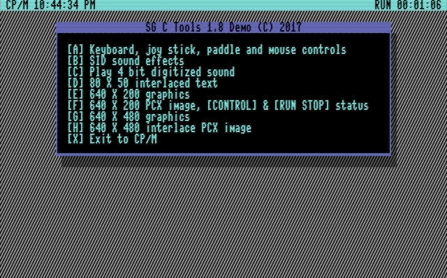
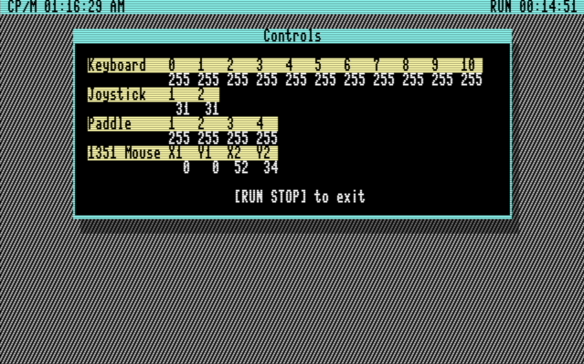
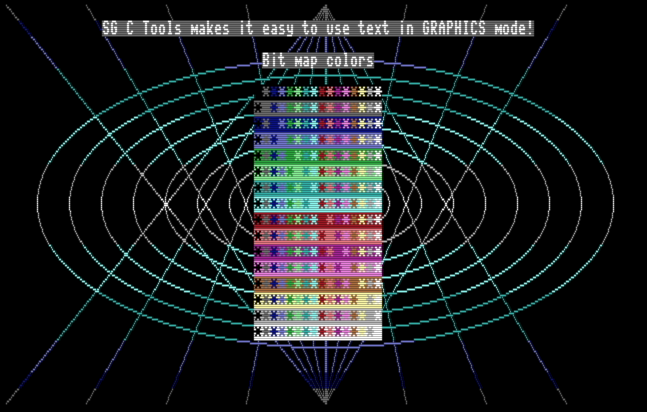
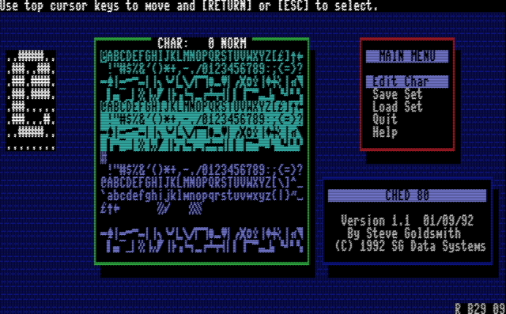
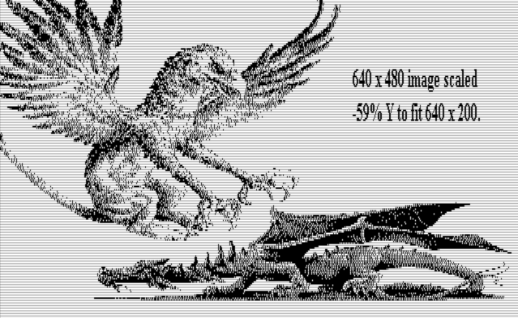
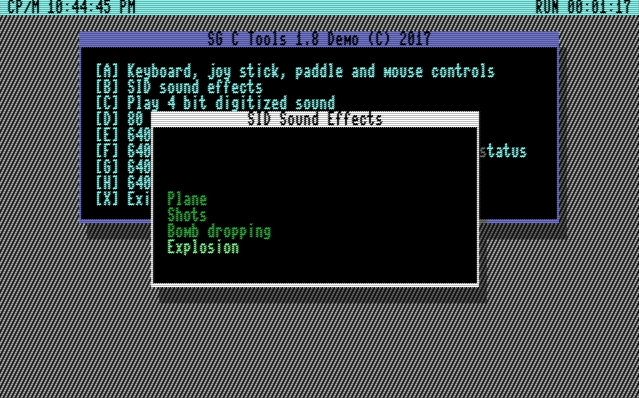
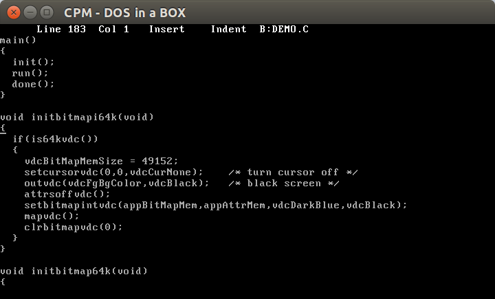
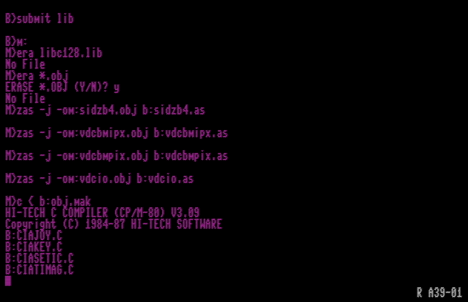

# SG C Tools 1.8                                               

## Introduction
Let's face it, the [C128](https://en.wikipedia.org/wiki/Commodore_128) (I bought a C128D in 1987 after my C64 died) wasn't that fast with the original Commodore CP/M (85 and 87 releases). I eventually graduated to [ZPM 3](ftp://www.zimmers.net/pub/cpm/sys/c128/system/zpm3n10.pma) and things were better. ZPM was compiled for the Z80 (vs 8080) and had performance/bug fixes included. Now that I had a decent C128 OS I wanted to develop programs that took advantage of the C128's unique hardware under CP/M.

I was developing with Turbo Pascal in the 80s and early 90s (on x86 hardware) and was happy to locate Turbo Pascal for CP/M. Not happy with the 8K runtime Turbo Pascal always added to the .com file I wanted to find something more efficient for the small TPA of the C128. I was also looking for an excuse to learn ANSI C and happened upon Hi-Tech C 3.09 for the Z80. SG C Tools is the result! Version 1.7 was the last release I did to GEnie.

This is the first release of version 1.8 on github more than 20 years later! I split the demo program into a c file and header file. I also added several other demo programs that I will explain below. If you happen to use the code on real hardware send me a photo or short video.

## Overview
SG C Tools ANSI C library unlocks the power of the C128 running CP/M!  High level and low level functions are included to access the [VDC](https://en.wikipedia.org/wiki/MOS_Technology_8563), [SID](https://en.wikipedia.org/wiki/MOS_Technology_SID) and [CIA](https://en.wikipedia.org/wiki/MOS_Technology_CIA). All source code is compatible with the Freeware version of Hi Tech C. A demo is included to show you how to use most features.

## Features
* CIA

 

    * Get/set TOD clocks
    * Convert TOD BCD to HH:MM:SS AM    
    * Set interrupt controllers  
    * Get/set 1.02 MHz timers
    * Convert Hz to timer latch value  
    * Read joy sticks and low level keyboard scan
    * Demo shows you how to read 2 joy sticks, 4 paddles, 2 mice and the extended 128 keyboard
* VDC

 

    * Fast I/O
    * Buffered I/O
    * Copies
    * Scrolling
    * Page flipping
    * Text output windows
    * 80 X 50 interlace text
    * Supports 16K and 64K mode
    * Fast graphics primitives for pixel plotting, lines, ellipses and text
    * Demo shows you how to do windows and graphics
    * CHED 80 character editor included
 
    
* View PCX images

 
 
    * Use industry standard .PCX images in your C programs
    * Demo shows you how to view 640 X 200 and 640 X 480 images
* SID

 

    * Read pots
    * Read 1351 compatible mouse
    * Clear SID
    * Set master volume
    * Set envelopes
    * Set attack/release cycles
    * Set pulse wave
    * Demo includes sound effects!
* Play 4 bit digitized sounds
    * You can play .RAW or Zounds type sound files in your C programs
    * Demo shows you how to play a .RAW file

## Requirments
* [MyZ80](http://www.z80.eu/myz80cpm.html) running under [dosemu](http://www.dosemu.org/) (tested under Ubuntu 16.04), [VICE](http://vice-emu.sourceforge.net/) emulator, A C128 or C128D running CP/M 3.0 with at least two 1581s, one 1571, large RAM disk or hard drive. Building from source is really slow using a real C128, so I would use the MyZ80 emulator.
* 80 column monitor for VDC specific routines. 640 X 480 interlace graphics requires a monitor that can handle this format.
* ANSI C programming experience.

## Using MyZ80 under dosemu

Using MyZ80 under dosemu is going to be the most efficient way to work on code for C128 CP/M (or any other Z80 based CP/M platform). Even decades after last using it I'm amazed how fast it is even though it only uses one core. MyZ80 is better than using VICE and increasing the emulation speed. Once the C library is built though programs compile fast enough using a real C128 or emulator. I'm providing you my development environment from the early 90s since it was already configured for ZPM 3 and has all the required tools. I've updated it to be Y2K compliant, but some utilities may still have issues.
* Install dosemu `sudo apt-get install dosemu`
* Download [cpm.zip](https://github.com/sgjava/garage/raw/master/commodore/cpm/sgctools/cpm.zip)
* Extract zip to ~/.dosemu/drive_c
* `dosemu`
* `cd cpm`
* `cpm`

The virtual drives are configured as follows:
* A: MyZ80
* B: Hi-Tech C and SG C Tools source
* C: Utilities

To build `libc128.lib` make sure all source files reside in the same drive and user as HTC.
* `b:`
* `submit lib`

Assembles, compiles and creates `libc128.lib`.

To build all demos use:
`submit demos`

To compile individual programs use (see demos.sub):
`c -o -x pgmname.c -lc128`

There are a couple of ways to copy the compiled code to a real C128 or emulated C128.
* To move code to a d41, d71, d81, etc.
    * Use pmarc or other archive program to archive.
    * Use MyZ80 `export` command to copy from CP/M to DOS
    * Use [DroiD64](http://droid64.sourceforge.net/) to copy files to a blank d64, d71 or d81
    * Use [BBR 128](http://commodore.software/downloads/download/161-data-conversion-tools/1165-big-blue-reader-128-v4-10) to copy files from standard formated d64, d71 or d81 to CP/M formatted d64, d71 or d81.
* To move code to a real C128 with a 1571 (this was how I did it in the 90s and it works with a single 1571)
    * Format floppy on PC or C128 with compatible format such as Kaypro
    * Use MyZ80 `export` command to copy files from CP/M to DOS
    * Use [22DISK](http://www.gaby.de/ecconver.htm) to copy to a floppy
    
## Doing it old school

If you really want to build on a real C128 or with VICE there's a few things you need to know. You will need 3 drives or 2 drives and a REU. I built the lib.sub submit file and lib.mak with the REU in mind. You will need to do a find and replace `m:` to drive `c:` or `d:` on lib.sub and lib.mak. On a real C128 it should take about 2 hours. I used warp mode (Alt+W) in VICE hovered around 1000%. The good thing is that warp mode updates the CP/M clock, so I can get a good estimated time on real hardware.

The drives are configured as follows:
* [A:](https://github.com/sgjava/garage/raw/master/commodore/cpm/sgctools/boot.d81.zip) ZPM 3 and HTC 3.09
* [B:](https://github.com/sgjava/garage/raw/master/commodore/cpm/sgctools/sgctools18.d81.zip) SG C Tools source
* M: (C: or D:) Output for .obj and .lib files
* `b:`
* `submit lib`
* Use `nswp`to copy m:libc128.lib to a:
* `b:`
* `submit demos`

To compile individual programs use (see demos.sub):
`c -o -x -i0:b: pgmname.c -lc128`

### FreeBSD License
Copyright (c) Steven P. Goldsmith

All rights reserved.

Redistribution and use in source and binary forms, with or without modification, are permitted provided that the following conditions are met:
* Redistributions of source code must retain the above copyright notice, this list of conditions and the following disclaimer.
* Redistributions in binary form must reproduce the above copyright notice, this list of conditions and the following disclaimer in the documentation and/or other materials provided with the distribution.

THIS SOFTWARE IS PROVIDED BY THE COPYRIGHT HOLDERS AND CONTRIBUTORS "AS IS" AND ANY EXPRESS OR IMPLIED WARRANTIES, INCLUDING, BUT NOT LIMITED TO, THE IMPLIED WARRANTIES OF MERCHANTABILITY AND FITNESS FOR A PARTICULAR PURPOSE ARE DISCLAIMED. IN NO EVENT SHALL THE COPYRIGHT HOLDER OR CONTRIBUTORS BE LIABLE FOR ANY DIRECT, INDIRECT, INCIDENTAL, SPECIAL, EXEMPLARY, OR CONSEQUENTIAL DAMAGES (INCLUDING, BUT NOT LIMITED TO, PROCUREMENT OF SUBSTITUTE GOODS OR SERVICES; LOSS OF USE, DATA, OR PROFITS; OR BUSINESS INTERRUPTION) HOWEVER CAUSED AND ON ANY THEORY OF LIABILITY, WHETHER IN CONTRACT, STRICT LIABILITY, OR TORT (INCLUDING NEGLIGENCE OR OTHERWISE) ARISING IN ANY WAY OUT OF THE USE OF THIS SOFTWARE, EVEN IF ADVISED OF THE POSSIBILITY OF SUCH DAMAGE.
