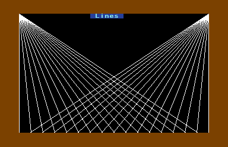
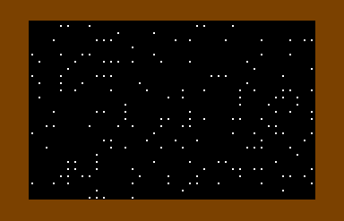
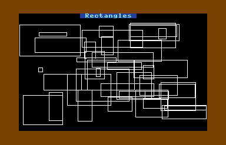
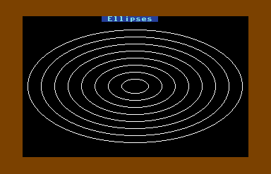
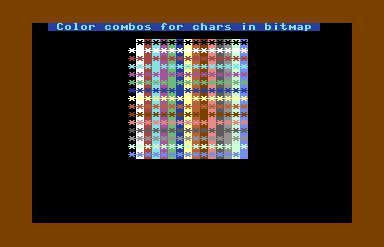

# C128 CP/M VIC Demo                                               

[](https://youtu.be/htmWCC5GO1U)

Click picture to see video.

## Introduction
This was one of the last things for me to accomplish in C128 CP/M mode that I
didn't include in [SG C Tools](https://github.com/sgjava/garage/tree/master/commodore/cpm/sgctools).
Now more than 26 years later I figured out how to use the VIC in CP/M mode.
It started off as an end of the year one night power hack, but turned into a
several night hackathon. The result is full control of the VIC with some 
limitations (like character ROM at $1000 in VIC bank and sprite issues). There
were false starts such as trying to figure out if I could access the normal 40
column screen in MMU bank 0. This took me down a rabbit hole, but it also
refreshed my memory about how things work in C128 CP/M land. Suffice to say
bank 0 is like Vegas. What happens in bank 0 stays in bank 0 (except for color
memory).

## Overview
VIC Demo is a single C source file that demonstrates how to leverage the
[VIC-II E](https://en.wikipedia.org/wiki/MOS_Technology_VIC-II) in CP/M mode.
My goal was to try 100% C language without any assembler (no premature
optimization) and the results are pretty amazing relative to normal CP/M 40
column mode. Text output is blazing fast even in bitmap mode. I use the VDC
character set to match what I use in 80 column mode, but on a smaller screen.
16 bit operations are used for clearing memory, rendering characters in bitmap
mode, etc. Basically this speeds those operations up 2x. The line and ellipse
primitives are pretty fast considering that C is used to draw and set the pixel.

I developed the code 100% on VICE and no longer have a C128 to test on. It would
be nice if someone could validate the demo on a real C128. If you find any issues
please create an issue on Github.

All source code is compatible with the Freeware version of Hi Tech C.

## Features
* Easy to configure VIC mode and memory layout
* Fast text output (even faster without color)
* Custom character sets
* Page flipping
* Scroll entire screen
* Side scroller with sprite
* Eight sprites animated
* Bitmap mode with text, line and ellipse functions

## Requirments
* [VICE](http://vice-emu.sourceforge.net/) emulator or A C128/C128D running
CP/M 3.0 with at least one 1581 for development or one 1541/1571 to run
vicdemo.com.
* Commodore 128 and ANSI C programming experience.

## Programming considerations
I didn't use MyZ80 to do the editing and compiling. I was able to work with
VICE and warp mode to do most of the editing and compiling. Of course it's much
slower, but the edit, compile and run cycles were easier to deal with. For larger
refactoring and formatting I used the following method:
* Use BBR 128 to transfer CP/M source to commodore formatted disk.
* Export to file system with `c1541 -attach export.d71 -read "vicdemo.c,s"`
* Edit in Eclipse with CDT or another editor.
* Import file to commodore formatted disk with `c1541 -attach export.d71 -write vicdemo.c vicdemo.c,s`
* Use BBR to transfer source from commodore formatted disk to CP/M formatted disk.

If you want to save some steps doing the import/export from disk image to Linux:
you can build ctools.  
* `git clone https://github.com/mist64/ctools`
* `cd ctools/src`
* Make simple changes in [PR](https://github.com/mist64/ctools/pull/1/commits/f9c41bed64ebf818cfba8dad497451c16b034abe)
* `make`
* `make install`

Files are installed to ../bin. To export a file from d64/d71 (d81 not supported):
* `ctools export.d71 g memtest.c`

This is way easier than fiddling with BBR. 

I also booted into 80 column mode to program, so I was using the C128 in dual
head mode. I cannot see anyone editing code in standard 40 column mode. If you
are running vicdemo.com on a real C128 you can boot in 40 column mode and run
from the command line.

To compile boot [d81 disk](https://github.com/sgjava/garage/raw/master/commodore/cpm/vicdemo/vicdemo.zip)
and enter the following at the command prompt  `c -o -x vicdemo.c`. Use warp mode to speed things up.
I used the turbo editor which is on the disk.

To run boot disk and enter `vicdemo` at command prompt.

### How to manage VIC memory in CP/M
I did a smoke test of using MMU bank 1 for the VIC instead of bank 0 (the CP/M
default). Once I was able to get that far I had to select a VIC 16K bank. For
smaller programs you can have the code and one character set and 2 screens in
VIC bank 0. For the demo I used VIC bank 1 since I used most of the first 16K
for my executable. This still leaves VIC banks 2 and 3 although some of bank
3 is used by CP/M. Also, remember character ROM is seen by the VIC at 0x1000.
You can still read and write to that memory with your program, so only
the VIC loses 4K of mappable RAM.

In your program you allocate a buffer to cover the VIC bank you are using. This
way your program will not overwrite VIC memory or visa versa you will not overwrite
the program's runtime memory. You calculate this by printing the pointer you will
use to reserve the VIC memory:

`uchar *vicMem = (uchar *) malloc(16384);` 

Once you have that address you would round that at the 16K boundary and in my case
add 16K for the VIC. So let's say vicMem starts at 0x3000 then I would need 0x1000
plus 0x4000 for VIC bank 1. Thus I would need to allocate ~20K. When I'm developing
I just make sure I have enough and don't worry about wasting a little. Once you are
done with the program however you could calculate it down to the byte and not waste
any memory.

### Limitations
As I mentioned before 0x1000 is always read by the VIC as character ROM. You can
still read and write to the memory with your program. You could store extra
character sets, sprites, etc. there and copy them as needed for example.

Sprites flicker and cause characters on the screen to flicker too. I'm not sure
if this is VICE or if it would happen on a real C128. 

### Return to CP/M mode
You should return to CP/M like nothing happened to the VIC. Color memory is restored
when you exit back to CP/M, so no code is required for that. To restore VIC for CP/M
use:

```
/* CPM default */
setChrMode(0, 0, 11, 3);
/* Enable CIA 1 IRQ */
outp(0xdc0d, 0x82);
```
## VIC Demo
VIC Demo is the blueprint for using the VIC in CP/M mode. By looking at the C
code you could develop Z80 Assembler, Turbo Pascal, etc. type code. The all in
one nature of the program makes it easier to see how everything fits together
in one place. At some point I might be driven to make a library and make life
easier and programs only use functions you include. For now this is my test
bed.

Press Return to go to next section of demo. Since I disable CIA 1 and CIA 2
interrupts I have a key scan function that scans the entire keyboard. 


Fast color text bouncing around the screen. If you do not update the
color memory it's even faster. You are not limited to the slow stdout of CP/M.



Using 16 bit memory moves, raster polling and page flipping you can create a snow
fall effect.


Custom characters, sprite, page flipping and raster polling used to create side
scroller effect with moving sprite.


Eight sprites animated and bouncing off the border.


Modified Bresenham's line algorithm for fast line plotting in CP/M.



Use line function to draw random rectangles.



Draw ellipses using digital differential analyzer (DDA) method.



In bitmap mode you can have unique background and foreground colors for text at
character level.

## FreeBSD License
Copyright (c) Steven P. Goldsmith

All rights reserved.

Redistribution and use in source and binary forms, with or without modification, are permitted provided that the following conditions are met:
* Redistributions of source code must retain the above copyright notice, this list of conditions and the following disclaimer.
* Redistributions in binary form must reproduce the above copyright notice, this list of conditions and the following disclaimer in the documentation and/or other materials provided with the distribution.

THIS SOFTWARE IS PROVIDED BY THE COPYRIGHT HOLDERS AND CONTRIBUTORS "AS IS" AND ANY EXPRESS OR IMPLIED WARRANTIES, INCLUDING, BUT NOT LIMITED TO, THE IMPLIED WARRANTIES OF MERCHANTABILITY AND FITNESS FOR A PARTICULAR PURPOSE ARE DISCLAIMED. IN NO EVENT SHALL THE COPYRIGHT HOLDER OR CONTRIBUTORS BE LIABLE FOR ANY DIRECT, INDIRECT, INCIDENTAL, SPECIAL, EXEMPLARY, OR CONSEQUENTIAL DAMAGES (INCLUDING, BUT NOT LIMITED TO, PROCUREMENT OF SUBSTITUTE GOODS OR SERVICES; LOSS OF USE, DATA, OR PROFITS; OR BUSINESS INTERRUPTION) HOWEVER CAUSED AND ON ANY THEORY OF LIABILITY, WHETHER IN CONTRACT, STRICT LIABILITY, OR TORT (INCLUDING NEGLIGENCE OR OTHERWISE) ARISING IN ANY WAY OUT OF THE USE OF THIS SOFTWARE, EVEN IF ADVISED OF THE POSSIBILITY OF SUCH DAMAGE.
