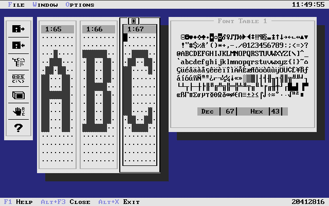
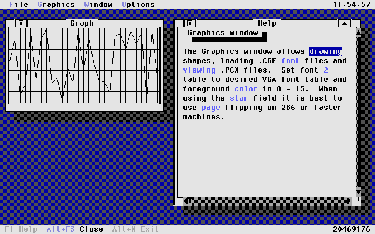
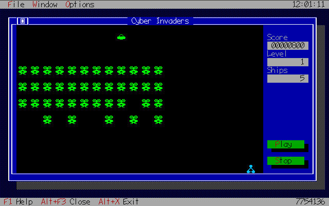
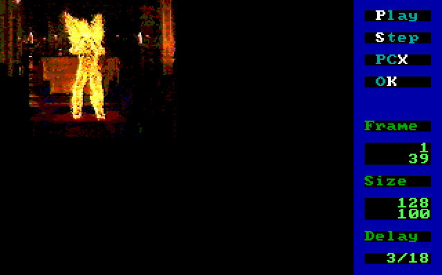
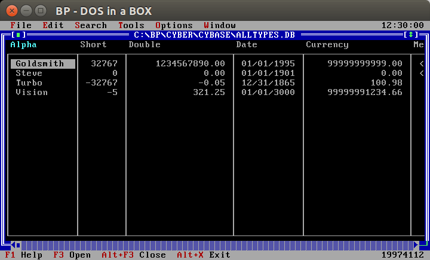
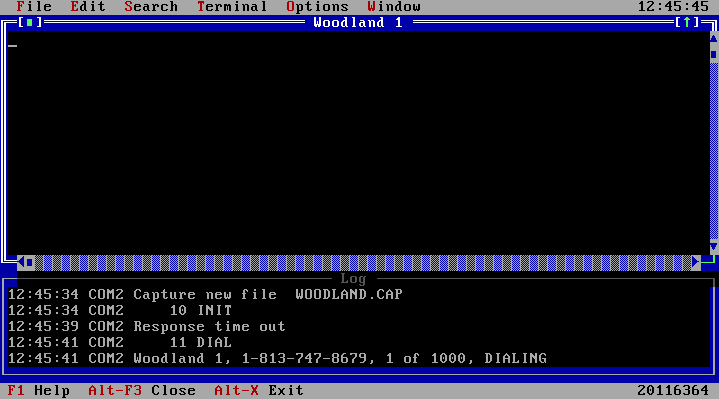

#Turbo Vision CyberTools                                                

Turbo Vision (tm) is a great object-oriented framework for building DOS applications. Unfortunately, fonts, graphics, 256 color animation, ANSI terminals, generic database browsers and other 'drop-in' tools are not included. You could spend a small fortune on commercial or Shareware libraries just to find out you bought a disjointed set of TV gizmos and gadgets in beta testing. Your DOS Real and DPMI applications need a competitive edge to be successful. Turbo Vision CyberTools gives you that edge by creating professional applications with a flexible set of tools. Powerful tools are important, but applications that show you how to use the library are equally important. All too often you get a 'powerful' commercial library with 100 line demo programs that barely scratch the surface (or gasp, have error handling). With CyberTools you get full blown applications and not empty skeleton code.

CyberTools was used all over the world in everything from embedded systems to foreign language products.

###Requirements
* IBM PC or 100% compatible
* MS DOS compatible OS
* Borland Pascal 7.x or Turbo Pascal 7.x with Turbo Vision 2.x
* VGA display for CyberFont apps and CyberAnimaton app
* Borland Paradox Engine 3.x for CyberBase app
* Turbo Power Async Professional 2.x for CyberTerm app
* Working knowledge of Pascal, OOP and Turbo Vision

###Using Borland Pascal under dosemu

Using Borland Pascal under dosemu is going to be the most efficient way to work on code. I'm providing you my development environment from the 90s since it was already configured and has all the required tools. I've updated it to work on fast CPUs (fixed runtime 200 errors), but there could be other issues. It looks like everything is Y2K compliant including Paradox Engine! See application source for IDE paths.  Help files (??HELP.TXT) need to be compiled with Turbo Vision Help Compiler 1.1 (\BP\EXAMPLES\DOS\TVDEMO\TVHC.PAS) that comes with TVDEMO.
* Install dosemu `sudo apt-get install dosemu`
* Download [bp.zip](https://github.com/sgjava/garage/raw/master/commodore/dos/cybertools/bp.zip)
* Extract zip to ~/.dosemu/drive_c
* Add c:\bp\bin to path in ~/.dosemu/drive_c/autoexec.bat
* `dosemu`
* `bp`

###CyberTools object graph

CyberTools takes advantage of OOP programming techniques to create reusable modular code.  Take some time and study the tree to give you an overview of the CyberTools object hierarchy. This was the 2.5 graph. I've added stuff in the unreleased 2.6 :)

```
─Objects
 ├──Root
 │  ├──AbstractPort
 │  │  └──UartPort
 │  │     └──ctUartPort
 │  └──AbstractProtocol
 │     ├──AsciiProtocol
 │     │  └──ctAsciiProtocol
 │     ├──KermitProtocol
 │     │  └──ctKermitProtocol
 │     ├──XmodemProtocol
 │     │  ├──ctXmodemProtocol
 │     │  └──YmodemProtocol
 │     │     └──ctYmodemProtocol
 │     └──ZmodemProtocol
 │        └──ctZmodemProtocol
 └──TObject
    ├──TAnsiEmu
    ├──TChrGenFile
    ├──TCollection
    │  └──TSortedCollection
    │     └──TPhoneCollection
    ├──TLabelNode
    ├──TpxeField
    ├──TpxeFieldDesc
    ├──TpxeRecord
    ├──TReadPCXFile
    │  ├──TDecodePCXFile2
    │  │  └──TPCXToChrTable
    │  └──TDecodePCXFile256
    ├──TReadSnpFile
    │  ├──TDecodeSnpFile
    │  └──TDecodeSnpScr
    ├──TScriptCompile
    ├──TScriptEng
    ├──TScriptNode
    ├──TStackNode
    ├──TTermRec
    ├──TVarNode
    ├──TView
    │  ├──TBackView
    │  ├──TChrEditView
    │  ├──TChrSetEditView
    │  ├──TChrSetView
    │  ├──TCluster
    │  │  ├──TCheckBoxes
    │  │  │  └──TCheckBoxesCF
    │  │  ├──TMultiCheckBoxes
    │  │  └──TRadioButtons
    │  │     ├──TMsgButtons
    │  │     └──TRadioButtonsCF
    │  │        └──TMsgButtonsCF
    │  ├──TColPalView
    │  ├──TEditor
    │  │  └──TFileEditor
    │  │     └──TCyFileEditor
    │  ├──TFileInfoPane
    │  │  └──TInfoPane
    │  ├──TGroup
    │  │  ├──TDesktop
    │  │  ├──TProgram
    │  │  │  └──TApplication
    │  │  │     ├──TCyberAni
    │  │  │     ├──TCyberBase
    │  │  │     ├──TCyberEdit
    │  │  │     ├──TCyberGame
    │  │  │     └──TCyberTerm
    │  │  └──TWindow
    │  │     ├──TDialog
    │  │     │  ├──TChrEditDlg
    │  │     │  ├──TChrSetDlg
    │  │     │  ├──TChrSetEditDlg
    │  │     │  ├──TDirWindow
    │  │     │  ├──TDriveDlg
    │  │     │  ├──TGameDlg
    │  │     │  ├──TGameOptsDlg
    │  │     │  ├──TPalDlg
    │  │     │  ├──TPCXSNP
    │  │     │  ├──TpxeCreateDialog
    │  │     │  ├──TpxeEngineCfg
    │  │     │  ├──TpxeIndexDialog
    │  │     │  ├──TpxeKeyDialog
    │  │     │  ├──TpxeMemoEdit
    │  │     │  ├──TpxeTableWin
    │  │     │  ├──TScrOptsDlg
    │  │     │  ├──TSnipDialog
    │  │     │  ├──TStrListDlg
    │  │     │  ├──TTermConfigDlg
    │  │     │  ├──TTermGenDlg
    │  │     │  ├──TToolBarDlg
    │  │     │  └──TWinSizeDlg
    │  │     ├──TEditWindow
    │  │     │  └──TCyEditWindow
    │  │     ├──TLogWin
    │  │     └──TTermWin
    │  ├──TIconView
    │  ├──TInputLine
    │  │  ├──TDirWinLine
    │  │  └──TpxeTableLine
    │  ├──TListViewer
    │  │  └──TListBox
    │  │     ├──TpxeFieldListBox
    │  │     └──TSortedListBox
    │  │        └──TTermListBox
    │  ├──TpxeTableView
    │  ├──TScroller
    │  │  ├──TAnsiTerm
    │  │  ├──TOutlineViewer
    │  │  │  └──TDirectoryViewer
    │  │  │     └──TDirViewer
    │  │  └──TTextDevice
    │  │     └──TTerminal
    │  │        └──TLogTerm
    │  ├──TSpriteView
    │  │  ├──TBombView
    │  │  ├──TExpView
    │  │  ├──THeadView
    │  │  ├──TShipView
    │  │  ├──TShotView
    │  │  └──TUfoView
    │  └──TStaticText
    ├──TWritePCXFile
    │  ├──TEncodePCXFile2
    │  │  └──TChrTableToPCX
    │  └──TEncodePCXFile256
    └──TWriteSnpFile
```

###CyberFont

 

* Easily add CyberFont's functionality to new or existing programs. You DO NOT have to use a different coordinate system (BGI), special object types (GView, GWindow, etc.) or BGI drivers like other slow graphic enhancements. CyberFont is 100% compatible with all your current and future TV applications. CyberFont doesn't require you to modify or patch the RTL, so it will also be compatible with future TV, RTL and 32 bit protected mode releases!
* Low level access to the VGA's CRT, attribute, graphics and sequencer controllers is provided for VGA hackers who like to
tinker.  All assembler code is in BASM (Built in Assembler), so no external assembly is needed. BIOS routines are also included for the highest level of compatibility.
* Fast graphics primitives included for pixels, lines and ellipses. Do graphic pie charts, bar graphs, line graphs, etc.
 
* Load, modify and save fonts.  Allows unlimited selection of fonts for text mode. Create graphic radio buttons, check boxes and other graphic controls like Nortons (tm) and Central point (tm) DOS products use.
* Load, modify, save and view .PCX images in text mode! Use your favorite paint program or CyberEdit to edit fonts.
* 640 X 400 pixel resolution in text mode to eliminate gaps between characters. This allows uniform backgrounds, sprite animation, bit maps and graphics not possible in standard text mode.
 
* Access all 8 font tables available with the VGA instead of the 2 provided by BIOS.
* CyberFont applications can use page flipping for flicker free animation and consistent timing. This is a must for any serious animation on the VGA.
* Flicker free DAC palette changes, fades and attribute controller access.
* Load and save fonts, graphics, palettes, configuration, etc. using TV streams.  You can also save your desk top on the same stream!
* Shell to DOS or use any VGA graphics mode while preserving the desk top, font and palette.
* New CYBERAPI shows you an example of overlaying VGA primitives in a DLL.
* CyberFont (tm) provides fonts, graphics, PCX images, sprites, bitmap animation and DAC palettes. CyberFont is simply the fastest and easiest to use Turbo Vision graphics enhancement around. Now with new Windows (tm) look for CyberFont apps!

####How does CyberFont work?

CyberFont takes advantage of the VGA's ability to redefine character sets, display 512 characters at the same time and display 640 pixels per line in text mode. The VGA BIOS can manipulate fonts, but is limited by slow speed, screen flicker, 720 pixels per line and write only font memory.

####Accessing font memory

Read/write access to font memory is provided by AccessFontMem in the VGA.PAS unit. AccessFontMem switches in bit plane 2 which is addressed at A000:0000.  During font memory access you must not access screen memory at B800:0000 or the display will freeze.  This is a limitation of the VGA's memory addressing scheme and not CyberFont. Use TV's HideMouse to prevent the mouse cursor from writing to the screen. Each character takes up 32 bytes in the table regardless of actual size and starts with the first row of 8 pixels defining the character. To find the first byte of any character use A000:???? + character code * 32.  The ???? represents the character table offset in memory. Each byte makes up a row of pixels with 1 bits being foreground color and 0 bit being background color.  AccessScreenMem switches the VGA back to access screen memory with ASCII codes in bit plane 0 and attributes in bit plane 1.
```
         Byte

........  0
........  1
...█....  2
..███...  3
.██.██..  4
██...██.  5
██...██.  6
███████.  7
██...██.  8
██...██.  9
██...██. 10
██...██. 11
........ 12
........ 13
........ 14
........ 15
         16-31 unused for 8 X 16 fonts
```

Sample 8 X 16 letter 'A' is formed by setting bits for foreground color and clearing bits for background color.  Notice bytes 16 - 31 are unused.

```
         Table        Offset
 ┌───────────────────┐
 │ Character table 7 │ E000
 ├───────────────────┤
 │ Character table 3 │ C000
 ├───────────────────┤
 │ Character table 6 │ A000
 ├───────────────────┤
 │ Character table 2 │ 8000
 ├───────────────────┤
 │ Character table 5 │ 6000
 ├───────────────────┤
 │ Character table 1 │ 4000
 ├───────────────────┤
 │ Character table 4 │ 2000
 ├───────────────────┤
 │ Character table 0 │ 0000
 └───────────────────┘
 ```
 
Character table locations at segment A000 while accessing bit plane 2.

####Displaying 512 characters on the screen

To get 512 characters on the screen you need to change the character map select register of the sequencer controller with
FontMapSelect.  The 256 characters from the first font are selected by using foreground colors 0 - 7. The second 256 characters are selected by using colors 8 - 15 or setting bit 3 of the attribute byte. This allows you to use the first font for the TV desk top and the second font for graphics, sprites, etc. You can use any of the 8 tables from above for either font.

####Setting text screen to 640 x 200 pixels

To change the screen from 720 X 400 pixels to 640 X 400 pixels use SetChrWidth8.  This reprograms the VGA clock to 25.175 MHz and makes each character 8 pixels wide instead of 9 pixels. SetChrWidth9 or setting the video mode with a BIOS function sets the screen back to 720 X 400.

####Character generator file (CGF) file format

CGF files are quite simple to decode and use on any system using character generators or bit map graphics. CGF files can be used on EGA, VGA, Windows apps and other hardware platforms. The 128 byte header is as follows:

```
  cgfHeader = record
    Version,
    Height,
    StartChr,
    TotalChrs : word;
    Filler : array[0..119] of byte;
  end;
```

* Version is at $0100 for 1.00.
* Height can be 8, 14, 16 or 32.  CyberFont uses 16 currently, but I have also used 8 (8 X 8 fonts) in VGA 80 X 50 text mode and on other platforms.
* StartChr is the starting ASCII code 0 - 255.
* TotalChrs is the total number of chars to load or save 1 - 256.
* Filler is not used in 1.00, but could be utilized by your apps. Keep in mind that CyberTools may update this format in the future and may not be compatible with your custom format.
* After the header is TotalChrs characters starting with StartChr.
* Each character is Height bytes long in the file.

####Character sprites

Character sprites like to ones in CyberGame use a technique that has been around for years.  I first used it in 1981 on a Commodore VIC 20. Use CyberEdit or any paint program that supports PCX files to create your sprite using one or more characters. Copy that sprite to adjacent characters and modify it to create movement. For example, you can create a bomb like the one in CyberGame with four characters:

```
   1        2        3        4
.██████. ........ ........ ........
..████.. ........ ........ ........
..████.. ........ ........ ........
...██... ........ ........ ........
........ .██████. ........ ........
........ ..████.. ........ ........
........ ..████.. ........ ........
........ ...██... ........ ........
........ ........ .██████. ........
........ ........ ..████.. ........
........ ........ ..████.. ........
........ ........ ...██... ........
........ ........ ........ .██████.
........ ........ ........ ..████..
........ ........ ........ ..████..
........ ........ ........ ...██...
```

You display characters one at a time in the same screen location. When the 4th frame is finished being displayed you move one character down and start over with 1.  I do not OR the sprite with any background character patterns, but that logic could be added at a loss of performance. CyberGame implements sprites descended from TView and is the best example of using character sprites in a CyberFont app.

####CyberFont applications

All CyberFont applications include a graphic desk top, load and/or save fonts and PCX images, configuration streams and context sensitive help.

* CYEDIT.PAS is a powerful 8 X 16 font editor. Edit multiple fonts from multiple font tables at the same time.  Uses graphic tool bar and custom character selector.
* CYGRAPH.PAS is a graphics application utilizing a resizable graphics window for lines, ellipses, rectangles, business X,Y type line graphs and a star field simulation. Configuration file compatible with CyberEdit 2.0.
* CYGAME.PAS is a multi-level 'Invaders' type arcade game using sprites, bit map animation, PC speaker sound and custom game controls. Turn page mode on in Options|Screen if the game animation runs too fast on your machine.  Uses custom configuration file to save control settings along with standard app data.

###CyberAnimation

 

CyberAnimation is a fast 256 color animation player, creator and PCX importer/exporter. Animation format faster and smaller than FLI format! Great for multimedia or game applications.

*Play 256 color Snip (.SNP) animation files created with a ComputerEyes/RT frame grabber, PCX files or other 256 color
animation formats that can be decoded to screen or memory.
* Export single movie frames as PCX files.
* Import a group of PCX files to create a Snip movie file.
* Decoding and play back faster than many commercial software schemes used under DOS and Windows. This allows slower 286 and 386 machines to enjoy animation that could only be played on newer/faster machines before.
* Snip files are typically 30% smaller than the same FLI encoded file.
* Snip files will appeal to multimedia and game programmers.

####How does CyberAnimate work

CyberAnimate decodes Snip files in real-time and does not require a decoded work file like CineMaker. You can decode to a mode 13H VGA screen or memory. Unchained mode 13H (mode x) can be implemented with many mode x libraries. I converted the original Michael Abrash articles from DDJ to TP6 BASM in 1991 before many of the mode x libraries appeared. Study the mode 13H BIOS decoder before writing your own mode x decoder.

####Snip file format

A Snip file contains a moving image.  The bytes in the file that make up word and longword values are all stored in low-to-high sequential (Intel) order.  First comes the 16 byte header:

```
  snpHeader = record
    Version,
    Frames,
    HorzRes,
    VertRes,
    Reserved1,
    Delay,
    Reserved2,
    Reserved3 : word;
  end;
```

* Version is at $0001 and is controlled by Digital Vision not CyberTools.
* Frames is the total number of frames.
* HorzRes can be 64, 128 or 256.  CyberTools supports up to 320 which is now supported by CineMaker too.
* VertRes can be 50, 100 or 200.  CineMaker now supports other resolutions besides  64 X 50, 128 X 100 and 256 X 200.
* Reserved1 is HorzRes*VertRes. Not documented in SNIPSPEC.DOC.
* Delay is 1/18 seconds delay.
* Reserved2 is 64 (DAC palette start).  Not documented in SNIPSPEC.DOC.
* Reserved3 is 255 (DAC palette end). Not documented in SNIPSPEC.DOC

I figured out the Reserved fields with a binary file viewer and experimentation!

* The 16 byte header is followed by a 768 byte calculated or fixed DAC palette. The palette contains all 256 colors, although only registers 64 to 255 are used for frame data.
* The frame table follows the DAC palette and is organized as follows:
    * Number of frames + 1 longwords of frame's seek position in the file.
    * The extra frame location is used to calculate the size of the last encoded frame.
    * Following the frame table is the encoded image data. Images are stored starting in the upper left corner, proceeding left to right for HorzRes pixels, then top to bottom for VertRes lines. If an image data value is 64 or greater, it is interpreted simply as a palette pointer and written to the screen at the current pixel location, which is incremented. If an image datavalue is > 0 and < 64 then it is interpreted instead as the number of pixels to skip. An image data value of 0 is interpreted as an end-of-frame flag.
    * The first frame in a Snip is considered all new so that there would be exactly HorzRes*VertRes bytes in the range 64 to 255. The amount of change from one frame to the next determines the amount of compression. Rapidly changing backgrounds will yield less compression as in side scrolling cartoons.


####CyberAnimate application

CYANI.PAS allows you to play Snips, export current frame as a PCX or create a Snip from PCX files. You can also view 256 and 2 color PCX files. Includes CyberFont desk top and smooth video mode changes.

###CyberBase



CyberBase for Paradox Engine 3.x includes a new generic table editor window, generic table and index create, memo editor,
cut and paste fields, easy engine configuration, automatic locks and validation. Windows and DOS based network sharing also supported.

###CyberTerm



CyberTerm for Async Professional 2.x is a professional multi-session async communications application with CyberScript
(tm) script language, IDE and supporting tools.  If you were disappointed with other Turbo Vision terminals then CyberTerm is for you!

### Critical error handler

I have installed a new critical error handler in all apps.  All apps will now pop up a message box with the error message and allow idle processing to continue.  This is a must for CyberTerm which can have multiple communication processes running at the same time.

CyberFont apps use page flipping for animation. If the error pops up when the screen is not on page 0 then you will not see the standard message line.  All that it takes to use the CyberTools error handler is the following in your main program:

```
{
Main app.
}

var

  MyApp : TSomeApp;

begin
  MyApp.Init;
  SysErrorFunc := AppSystemError; { <== add this for new handler}
  MyApp.Run;
  MyApp.Done
end.
```

The issue of being in a non-reentrant state when the handler is called has been raised. I have not had any problems accessing empty floppy drives, locked files on a net work, printer turned off, etc. You can remove my SysErrorFunc if you wish to use the default handler in DRIVERS.PAS.  If you do find a way to crash it let me know! The only way I know would be in a TSR or ISR, but who is going to use TV for a TSR?


CYBERANIMATE FEATURES


CYBERBASE FEATURES

A powerful new Paradox table editor allows you to easily create
single and multi-user database applications.  Just open a table
cursor on any index and let the editor do the rest.  No need to
hard-code table structures or use error prone scripts like many
other database libraries.

Create Paradox tables in minutes without writing any code!

Add or delete indexes on the fly.

Fields are validated to insure database integrity.  Use your own
validators by overriding the method that creates basic validators.

Memo editor is included with provisions for other custom blob
editors.

Cut and paste from the standard clip board!  Use it to import or
export memo BLOBs and all standard field types.

Explicit record locking with retry is automatically used if the
engine is initialized for network use.

Full control of engine configuration allows you to make changes
without recompiling application.

Use CyberFont to add graphics or charts to your database
applications!


HOW DOES CYBERBASE WORK?

CyberBase uses a powerful Paradox table editor which is basically
composed of a record collection of field collections (a dynamic 2
dimension array).  The records are translated and stored in a
viewable format which accounts for its responsiveness.  A
special input line is used as a table cursor to edit and browse.
When editing a field you cannot resize the window.  Also if you try
to leave focus in edit mode that field will be validated and
written.  Basic validation is provided by field type and can be
easily modified to handle custom validation.

As with any database API you should understand how Paradox Engine's
API and Database Framework operates before modifying the PXEDIT
unit for your own needs.  The PXE manuals Borland provides and
CyberBase are a good source of information.

IMPORTANT:

Remember to add TCursor.getTableHandle method to the Data Base
Framework in \BP\PXENGINE\PASCAL\SOURCE\OOPXENG.PAS.  This allows
PX Browse access to TCursor's private table handle tabH.  PX Browse
can then search on the primary index regardless of what index the
table is opened on.

SEARCH OOPXENG.PAS FOR 'searchIndex'

RIGHT AFTER:

  function searchIndex(keyRec: PRecord; mode: PXSearchMode;
    fldCnt: Integer): Retcode; virtual;

ADD:

  function getTableHandle : TableHandle;


SEARCH OOPXENG.PAS FOR 'TRecord methods'

RIGHT BEFORE:

*****************************************************************
*********
                          TRecord methods
*****************************************************************
*********

ADD:

function TCursor.getTableHandle : TableHandle;

begin
  getTableHandle := tabH
end;

CYBERBASE APPLICATION

CYBASE.PAS is a full featured generic data base application using
PX Edit unit to edit multiple Paradox tables on single user or
network systems.  Generic table and index creation fully supported.
Add a report generator and you will have one powerful generic data
base tool!


CYBERTERM FEATURES

CyberTerm provides a complete ANSI/VT100 terminal package.

Run multiple terminal windows and protocols at the same time!  Run
a Z modem download and play a door game on multiple BBSs.  You can
have up to four serial devices operating at the same time.

All the standard Async Professional features:  115K baud, 16550
UART FIFO buffering, all protocols Z/Y/X/K/A, hardware and software
flow control, COM1 - COM8, etc.

ANSI/VT100 emulation object includes support for IBM keyboard
remapping.

Fast ANSI terminal window with virtual buffering up to 132 column
X 1000 lines and Smart Cursor Tracking (tm).  Size not limited to
132 X 1000.

Local echo with ANSI emulation.

Capture file in raw (include ANSI codes) or cooked (strip ANSI
codes) mode.  This makes it easy to snag your favorite BBS screens
or entire sessions.

Log windows to track communication events from multiple sessions.
Display as little or as much information as you like.  Great for
debugging async applications or tracking connect time for cost
analysis.

Phone book with many configuration options.  Just double click on
entry to dial modem or connect to a local device.  Phone book is
saved with configuration stream to allow multiple phone books to
exist.

CyberScript (tm) is a powerful high level script language which
allows the automation of many on-line tasks.

Features:

     Numeric variable types in addition to string type

     Up to 16,000 variables

     Up to 16,000 level deep call nesting
     Basic math functions

     Boolean functions and other flow control commands

     Fast compile times (13000 lines a minute on a 386/33 in 16 bit
     DPMI).

Each line can consist of a blank, a comment (;), or a command.  You
can also indent comments, commands and params.

The format for a comment is:

 ;This is a comment

The format for a command is:

 COMMAND PARAMS

Examples:

 String  FirstName
 Assign  FirstName,'Steve'
 WaitFor 'First Name:'
 Send    FirstName

CyberScript currently supports STRING, LONGINT and DOUBLE user
definable variable types.  A variable must be declared prior to
referencing it in your script.  The format for declaring a variable
is:

 String  FirstName
 LongInt MessageCount
 Double  SellPrice

Commands like WAITFOR and SEND can handle all variable types.  For
example if you want to send a DOUBLE out the port use:

 Assign SellPrice,50000.00
 Assign Tax,5000.00
 Add    SellPrice,Tax
 Send   SellPrice

Will result in the string '55000.00' being sent out the port.
Commands like GETRESP only accept STRING and others like
WAITFORSECS except only LONGINT.  Constants can used in place of
variables for many commands:

 Send #27

Can be used to send an escape character or other non-editable
character.  Numeric constants can also be used:

 Add MessageCount,1
 Mul Tax,.05

             CyberScript command table
             ─────────────────────────
┌──────────────┐┌────────────────┐┌───────────────┐
│COMMAND       ││PARAM TYPE      ││VAR TYPE       │
└──────────────.└────────────────.└───────────────.
┌──────────────┐┌────────────────┐┌───────────────┐
│WAITFOR       ││constant/var    ││all            │
│SEND          ││constant/var    ││all            │
│GETRESP       ││var             ││string         │
│GETBLOCK      ││constant/var    ││string         │
│IF=           ││var,constant/var││all            │
│IF<>          ││var,constant/var││all            │
│IF<           ││var,constant/var││all            │
│IF>           ││var,constant/var││all            │
│IF<=          ││var,constant/var││all            │
│IF>=          ││var,constant/var││all            │
│ASSIGN        ││var,constant/var││all            │
│ADD           ││var,constant/var││all            │
│SUB           ││var,constant/var││longint,double │
│MUL           ││var,constant/var││longint,double │
│DIV           ││var,constant/var││longint,double │
│WAITFORSECS   ││constant/var    ││longint        │
│CALL          ││label           ││               │
│RETURN        ││                ││               │
│GOTO          ││label           ││               │
│LABEL         ││label name      ││               │
│CAPTUREAPP    ││constant/var    ││string         │
│CAPTURENEW    ││constant/var    ││string         │
│DOWNLOADZMODEM││constant/var    ││string         │
│STRING        ││var name        ││               │
│LONGINT       ││var name        ││               │
│DOUBLE        ││var name        ││               │
│WAITFORSEPCHAR││constant/var    ││string         │
│ADDGETDELIM   ││constant/var    ││string         │
│INIT          ││                ││               │
│DIAL          ││                ││               │
│HANGUP        ││                ││               │
│LOGON         ││                ││               │
│LOGOFF        ││                ││               │
│END           ││                ││               │
└──────────────.└────────────────.└───────────────.

HOW DOES CYBERTERM WORK?

The terminal window uses a state engine capable of multiple states.

ctCmdInit      = $00000001; {send init string}
ctCmdDial      = $00000002; {send dial string}
ctCmdDialPause = $00000004; {pausing between redials}
ctCmdRespWait  = $00000008; {waiting for modem response}
ctCmdRespRec   = $00000010; {received response}
ctCmdRespTime  = $00000020; {no response before time out}
ctCmdHangUp    = $00000040; {hang up modem}
ctCmdDTRLow    = $00000080; {dtr in low state}
ctCmdCTSWait   = $00000100; {waiting for cts to go high}
ctCmdCTSLow    = $00000200; {cts in low state}
ctCmdScript    = $00000400; {script engine in use}
ctCmdXferStat  = $00000800; {ok to do auto status updates}
ctCmdXferInit  = $00001000; {init file xfer}
ctCmdXfer      = $00002000; {xfering file}
ctCmdDownload  = $00004000; {download = 1, upload = 0}
ctCmdXferAbort = $00008000; {abort file xfer}
ctCmdXferMask  = $0000f800; {mask of just xfer commands}
ctCmdGenPause  = $00010000; {general pause}

For example, you can set the command state bits as follows to wait
for CTS to go high, send initialize string to modem and dial
number:

TW^.CmdState := ctCmdInit+ctCmdDial+ctCmdCTSWait;

The terminal window's state engine knows to wait for CTS first,
send the initialize string next and dial number in that order.  You
could also just dial the number:

TW^.CmdState := ctCmdDial;

Any time the command state is <> 0 then the ANSI emulator is not
called.  Also you cannot close a terminal window during protocols
unless you abort the protocol or wait for it to finish.  This
allows the protocols to exit in a stable state.

It is important that you do not leave the state engine in a invalid
state!  Study CyberTerm app for valid engine combinations.

Your apps idle method allows each terminal window a small amount of
processing time.  This is a simple form of time slicing which
allows your app to do other things while not servicing the terminal
windows.  Any time you set a terminal window's CmdState then that
command is processed during the next Idle cycle.

CYBERTERM APPLICATION

CYTERM.PAS is a complete ANSI terminal with point and shoot
operation.  With the addition of the CyberScript compiler you can
create powerful vertical market applications.  Realestate MLS
systems, Internet and other services are just ripe for a CyberTerm
app.  You could also parse input directly into a Paradox table
instead of parsing a capture file.  Drop in a Paradox browser and
view/edit the data real-time!

### FreeBSD License
Copyright (c) Steven P. Goldsmith

All rights reserved.

Redistribution and use in source and binary forms, with or without modification, are permitted provided that the following conditions are met:
* Redistributions of source code must retain the above copyright notice, this list of conditions and the following disclaimer.
* Redistributions in binary form must reproduce the above copyright notice, this list of conditions and the following disclaimer in the documentation and/or other materials provided with the distribution.

THIS SOFTWARE IS PROVIDED BY THE COPYRIGHT HOLDERS AND CONTRIBUTORS "AS IS" AND ANY EXPRESS OR IMPLIED WARRANTIES, INCLUDING, BUT NOT LIMITED TO, THE IMPLIED WARRANTIES OF MERCHANTABILITY AND FITNESS FOR A PARTICULAR PURPOSE ARE DISCLAIMED. IN NO EVENT SHALL THE COPYRIGHT HOLDER OR CONTRIBUTORS BE LIABLE FOR ANY DIRECT, INDIRECT, INCIDENTAL, SPECIAL, EXEMPLARY, OR CONSEQUENTIAL DAMAGES (INCLUDING, BUT NOT LIMITED TO, PROCUREMENT OF SUBSTITUTE GOODS OR SERVICES; LOSS OF USE, DATA, OR PROFITS; OR BUSINESS INTERRUPTION) HOWEVER CAUSED AND ON ANY THEORY OF LIABILITY, WHETHER IN CONTRACT, STRICT LIABILITY, OR TORT (INCLUDING NEGLIGENCE OR OTHERWISE) ARISING IN ANY WAY OUT OF THE USE OF THIS SOFTWARE, EVEN IF ADVISED OF THE POSSIBILITY OF SUCH DAMAGE.

